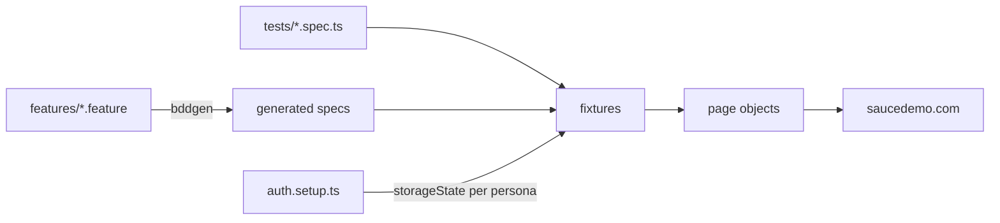
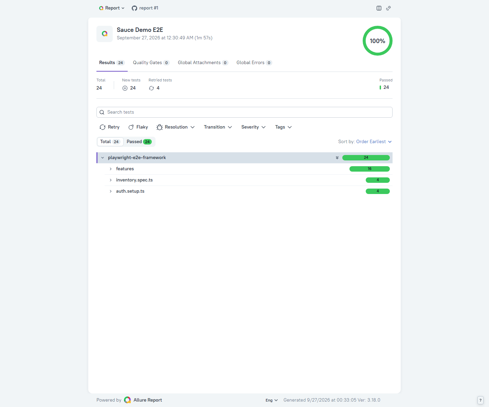

# Playwright E2E Framework

End-to-end tests for the Sauce Demo shop, written with Playwright and TypeScript and run on four browsers in CI.

[](https://github.com/jokvir/playwright-e2e-framework/actions/workflows/ci.yml)
[](https://jokvir.github.io/playwright-e2e-framework/)
[](LICENSE)

I picked [Sauce Demo](https://www.saucedemo.com) as the target because it ships with several user personas. Some of them are built to misbehave, which makes it a good place to show role-based testing and defect reporting, not only happy paths.

## What this project demonstrates

- A Page Object Model where each page owns its locators and actions, and the shared header is a component instead of a base-class dump.
- Custom Playwright fixtures that inject page objects and log in as a persona through `storageState` created once by a setup project.
- A BDD layer with playwright-bdd whose steps reuse the same page objects, next to plain specs for technical checks.
- Data-driven tests generated from typed catalog and customer data, with expected totals computed from the data rather than copied from the page.
- Known defects tracked with `test.fail()` and annotations, so a fix turns the test red and cannot go unnoticed.
- Visual regression with baselines rendered in the same Linux image as CI, and WCAG 2.1 AA scans with axe-core.
- Sharded cross-browser CI in the official Playwright container, merged reports, Allure history and GitHub Pages publishing.
- Flaky tests investigated from traces and fixed at the cause, not hidden behind retries.

## Tech stack

| Tool                                                  | Version                   | Role                                          |
| ----------------------------------------------------- | ------------------------- | --------------------------------------------- |
| Playwright Test                                       | 1.63.0                    | Runner, browsers, assertions, HTML report     |
| TypeScript                                            | 6.0.3                     | Strict mode, `noUncheckedIndexedAccess`       |
| playwright-bdd                                        | 9.2.1                     | Gherkin features compiled to Playwright tests |
| @axe-core/playwright                                  | 4.13.0                    | Accessibility scans                           |
| allure-playwright + Allure 3                          | 3.12.2 / 3.18.0           | Allure results and report, no Java needed     |
| ESLint + typescript-eslint + eslint-plugin-playwright | 10.11.0 / 8.70.1 / 2.12.0 | Type-aware linting                            |
| Prettier                                              | 3.9.9                     | Formatting                                    |
| Docker + Compose                                      | any recent                | Linux rendering for visual baselines          |
| GitHub Actions + GitHub Pages                         |                           | CI and report hosting                         |

## Architecture

```
.
├── .github/workflows/ci.yml   lint, sharded tests, report, deploy
├── docs/TEST_PLAN.md          scope, risks, entry/exit criteria, traceability
├── features/                  Gherkin: login, cart, checkout
├── src/
│   ├── data/                  users, products, checkout (typed)
│   ├── pages/                 BasePage, Header component, one class per page
│   ├── steps/                 step definitions reusing the page objects
│   ├── fixtures.ts            page objects, persona sessions, accessibility scan
│   ├── known-defect.ts        annotation helper for expected failures
│   ├── step.ts                @step decorator for readable reports
│   └── global-setup.ts        clears old Allure results once per run
├── tests/
│   ├── auth.setup.ts          logs in each persona and saves its session
│   ├── auth.spec.ts           protected pages without a session
│   ├── inventory.spec.ts      sorting, product details, cart badge
│   ├── known-defects.spec.ts  persona defects as expected failures
│   ├── visual.spec.ts         screenshots + Linux baselines
│   └── a11y.spec.ts           WCAG 2.1 AA scans
├── allurerc.mjs
├── compose.yaml               Playwright image for visual baselines
└── playwright.config.ts       projects, reporters, BDD generation
```



## Getting started

Prerequisites: Node.js 24 and, for visual tests only, Docker.

```bash
git clone https://github.com/jokvir/playwright-e2e-framework.git
cd playwright-e2e-framework
npm ci
npx playwright install --with-deps
npm test
```

No `.env` is needed: the config falls back to `.env.example`, which holds the public demo credentials. Copy it to `.env` to override them.

| Script                               | What it runs                                            |
| ------------------------------------ | ------------------------------------------------------- |
| `npm test`                           | Everything, on all four browser projects                |
| `npm run test:smoke`                 | Tests tagged `@smoke`                                   |
| `npm run test:bdd`                   | The Gherkin scenarios only                              |
| `npm run test:a11y`                  | Accessibility scans on Chromium                         |
| `npm run test:visual`                | Visual tests inside the Playwright Linux container      |
| `npm run test:visual:update`         | Regenerates the visual baselines in that container      |
| `npm run report`                     | Builds the Allure report from the last run and opens it |
| `npm run lint` / `npm run typecheck` | ESLint + Prettier, `tsc --noEmit`                       |

Visual tests are skipped with a reason outside Linux, because the baselines are rendered on Linux. Use `npm run test:visual` to run them from Windows or macOS.

## Running in CI

The [workflow](.github/workflows/ci.yml) runs on every push to `main`, on pull requests, every night at 03:00 UTC and on manual dispatch.

- Pushes and pull requests run the `@smoke` suite. The nightly and manual runs run the full regression, including visual and accessibility tests.
- The test job runs in `mcr.microsoft.com/playwright:v1.63.0-noble`, the same image that renders the visual baselines. It is a matrix of 4 browser projects by 4 shards.
- A report job merges the blob reports into one Playwright HTML report, builds the Allure report and carries the Allure history forward from the live site.
- A deploy job publishes both reports to GitHub Pages from `main` only. Pull request reports stay available as workflow artifacts.

Live reports: [Allure](https://jokvir.github.io/playwright-e2e-framework/) and [Playwright HTML](https://jokvir.github.io/playwright-e2e-framework/playwright/).

The Sauce Demo password is read from the `SAUCE_PASSWORD` repository secret. A fork needs that secret, set to the public demo value, before its first run.

Two things to know when reading the Allure report. The four `authenticate as ...` setup tests run once in every shard, so Allure lists them as retried tests. That count is not flakiness. Also, the default Allure 3 report template loads Google Analytics, and this version has no switch to turn it off.

## Test strategy and design decisions

The full plan, with risks and a traceability table, is in [docs/TEST_PLAN.md](docs/TEST_PLAN.md).

### What is covered

| Area                                 | Tests       | Where                   | Tags                              |
| ------------------------------------ | ----------- | ----------------------- | --------------------------------- |
| Login, logout, invalid credentials   | 7 scenarios | `login.feature`         | `@smoke`, `@regression`, `@guest` |
| Protected pages without a session    | 6           | `auth.spec.ts`          | `@regression`, `@guest`           |
| Sorting, product details, cart badge | 11          | `inventory.spec.ts`     | `@smoke`, `@regression`           |
| Cart                                 | 2 scenarios | `cart.feature`          | `@smoke`, `@regression`           |
| Checkout, totals, form validation    | 5 scenarios | `checkout.feature`      | `@smoke`, `@regression`           |
| Known defects                        | 5           | `known-defects.spec.ts` | `@regression`                     |
| Visual regression                    | 5           | `visual.spec.ts`        | `@visual`                         |
| Accessibility                        | 5           | `a11y.spec.ts`          | `@a11y`                           |

That is 36 tests per browser, plus the 10 visual and accessibility tests that run on Chromium only. Five of them per browser are tagged `@smoke`.

### Fixtures over hooks

I chose Playwright fixtures over `beforeEach` hooks because a test declares what it needs (`inventoryPage`, `cartPage`) and gets it, and nothing else runs. The `persona` option overrides the built-in `storageState` fixture, so switching user is one line: `test.use({ persona: 'problem_user' })`. A `@guest` tag gives a test an empty session, and the same tag works in Gherkin and in plain specs.

### BDD where it pays off

The business flows (login, cart, checkout) are written in Gherkin because they read as acceptance criteria. Technical checks such as redirects, sorting, screenshots and axe scans stay in plain specs, where Gherkin would only add wording. playwright-bdd compiles the features into regular Playwright tests, so they share fixtures, tags, retries, traces and sharding.

The generated specs have to live in the project's `testDir`. I point the output at `tests/` and let it land in `tests/features/`, which is git-ignored. That keeps one project per browser instead of doubling them.

### Known defects

Each defect test asserts the correct behaviour and is marked `test.fail()` with a `known-defect` annotation. The test passes while the bug exists and fails when the bug is fixed, which forces someone to update it. Because `test.fail()` also passes on any unrelated error, I checked each one without the marker to confirm it fails on the defect assertion itself.

| ID     | Persona       | Expected behaviour                        | Observed                                     |
| ------ | ------------- | ----------------------------------------- | -------------------------------------------- |
| SD-001 | problem_user  | Every product shows its own image         | All six show the same placeholder            |
| SD-002 | problem_user  | Shipping details can be submitted         | Typing a last name overwrites the first name |
| SD-003 | error_user    | An order can be finished                  | Finish throws a JavaScript error             |
| SD-004 | visual_user   | Prices match the catalog                  | Prices are random on every load              |
| SD-005 | standard_user | Item total is rounded to cents            | `$121.94999999999999` for some carts         |
| SD-006 | visual_user   | Products page matches the standard layout | Shifted icon, titles and button, wrong image |

SD-005 is not limited to the faulty personas: standard_user hits it too. The app adds prices as floating-point numbers in the order they were added to the cart, so the same five products give `$121.95` in one order and `$121.94999999999999` in another. The checkout scenario uses two products whose sum is exact, which is why only a targeted test could catch it.

I also saw defects that I did not automate: sorting has no effect and only some products can be added to the cart for problem_user and error_user.

### Visual regression

Screenshots differ between operating systems because of font rendering, so the baselines are generated inside the Playwright Linux image, locally through Docker Compose and in CI through the same image. The copyright line is masked because it contains the year. Nothing else on these pages changes between runs, and masking more would hide real regressions.

visual_user is compared against the standard products baseline as a known defect. During the first baseline update, that test overwrote the shared baseline with its broken render. It is now skipped whenever snapshots are being updated, and CI runs with `updateSnapshots: 'none'` so it can never write a baseline.

### Accessibility

Five page states are scanned with axe-core against WCAG 2.1 A and AA: login, login with an error, products, cart, and shipping details with an error. Error states get their own scan because messages injected at runtime are a common place for accessibility regressions. Any violation fails the test and is printed as a short rule, impact and selector list. The full axe JSON is attached to the report.

With axe 4.13.0 the scans find no WCAG 2.1 AA violations. axe could not decide the colour contrast of a few elements on the products page, and those are flagged in the report as `needs-manual-review`. Best-practice rules outside WCAG report a missing `<h1>`, content outside landmarks and one disallowed ARIA role. I do not fail the build on those.

In Québec, public-sector websites follow the SGQRI 008 accessibility standard, which is based on WCAG. An automated scan only covers part of WCAG: keyboard navigation, reading order and the quality of text alternatives still need a manual review.

### Flaky tests I found and fixed

- Firefox on Windows crashed inside its driver when eight workers ran four browsers at once. I capped `workers` at 4, which also keeps the load on a site I do not own reasonable.
- Sauce Demo is a single-page app, so the URL changes before the new page renders. Navigation steps now assert the destination page before acting on it.
- On WebKit, the burger menu sometimes swallowed the open click or closed itself right after opening. The traces pointed to the menu re-mounting after the page renders. The whole open-then-logout gesture is retried with `expect().toPass()`, and the scenario still has to end on the login page.

Retries are 0 locally and 2 in CI, so a flaky test is visible as flaky in both reports instead of silently passing.

### Respecting the demo site

Pushes run only the smoke suite, workers are capped at 4 and there is no load testing. Sauce Demo is a public demo and I treat it that way.

## Report



## Possible next steps

- Pin GitHub Actions to commit SHAs instead of major tags, to protect the pipeline from a compromised action.
- Keep the setup project out of the Allure report so its per-shard runs stop showing as retries.
- Switch to the Allure 2 report template, which honours `ALLURE_NO_ANALYTICS`, if tracking in the published report becomes a concern.
- Add keyboard-only journeys for login and checkout to cover what axe cannot check.
- Run the full regression on pull requests that touch `tests/`, `features/` or `src/`, and keep smoke for the rest.

## Author

Shones Tegang, QA Automation Engineer

- GitHub: [jokvir](https://github.com/jokvir)
- LinkedIn: [shones-tegang](https://linkedin.com/in/shones-tegang-5647741b5)
